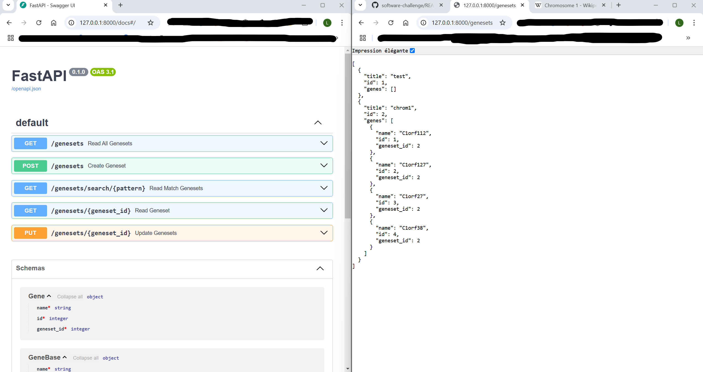
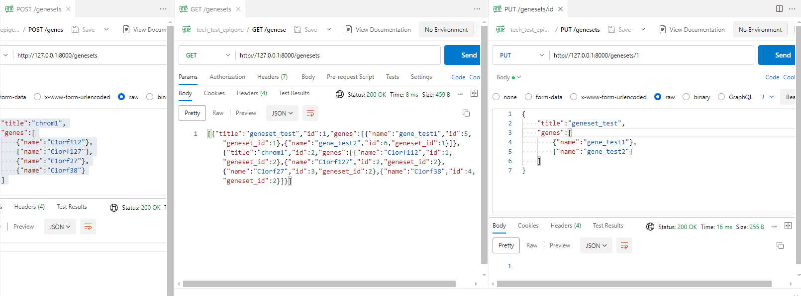

# 🌈 Track Frontend 

In that track, we will create an application that consumes the existing API.

## Level 0

Acces to API ok :

Creation and modification of a few genesets with Postman :

## Level 1

X

## Level 2

X

## Level 3

X

## Level 4 - Bonus

X