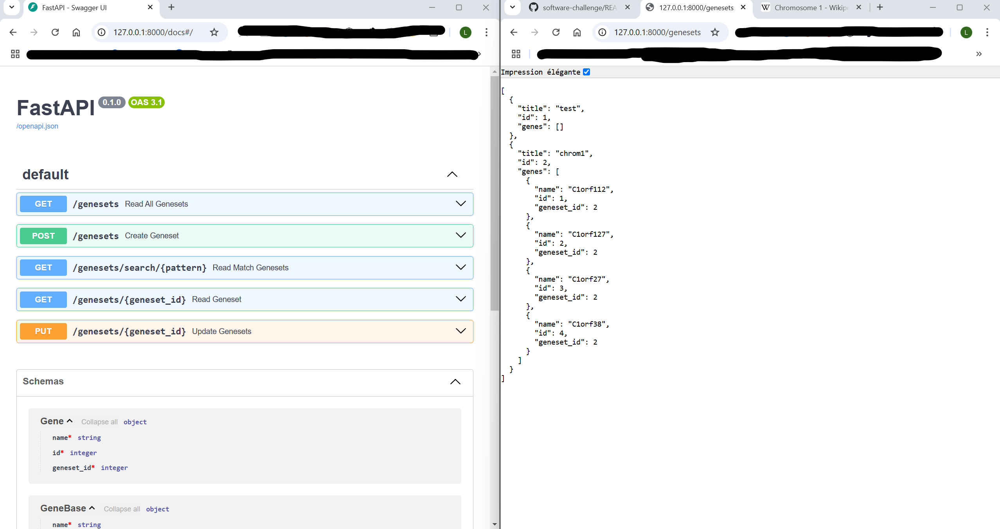
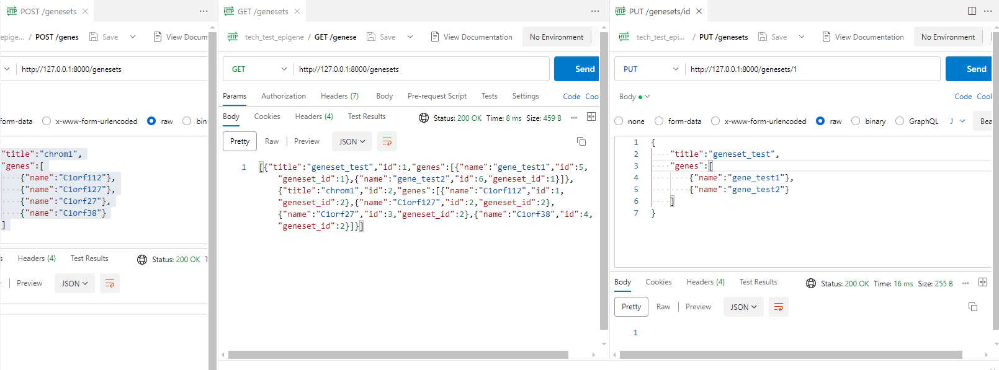

# 🌈 Track Frontend 

In that track, we will create an application that consumes the existing API.

## Level 0

Acces to API ok :

Creation and modification of a few genesets with Postman :

## Level 1

I run into an issue with CORS policy because my local react app at http://localhost:3000/ was not autorized. I started looking for solution to change smt in the backend but I do not know Python and I have to say I got a little bit of help on that to not waste too much time since I though it was not supposed to be part of the exercise.

## Level 2

X

## Level 3

X

## Level 4 - Bonus

X